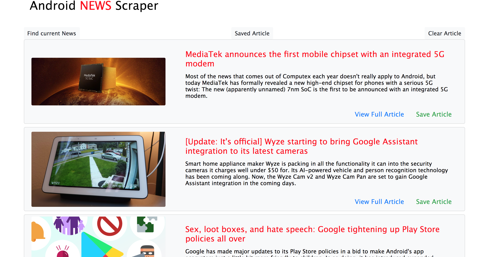

# News-Scrape headlines into MongoDB

 App built using MongoDB, Mongoose, Node.js, Express.js, Handlebars.js, HTML, and CSS. It scrapes the  android news from https://www.androidpolice.com homepage and stores article titles links picture, along with your notes , in MongoDB. The articles and notes collections reference each other through population.

https://blackice-news-ncraper.herokuapp.com/

## Get new articles, save favorites, and write notes

To see updated news stories, click `Get new articles` at the top of the `Home` page. To view the full article, click the `View article on ` link. 

When you see an article in the list that you want to mark as a favorite, click `Save article`, and read it again by clicking `Saved articles` in the top menu bar. After you have an article in your saved list, you can comment on it by clicking `Add note`.

## Local set up for development purposes

These must be installed to run the app locally:

- [Node.js](https://nodejs.org/en/)
- [npm](https://www.npmjs.com/get-npm)

## Technology

- HTML, CSS, jQuery, Bootstrap, [Handlebars.js](https://handlebarsjs.com/)
- JavaScript
- Node.js
- MongoDB and [Mongoose](http://mongoosejs.com/)
- [Express.js](https://expressjs.com/)
- npm, including [express](https://www.npmjs.com/package/express) and [body-parser](https://www.npmjs.com/package/body-parser) packages.
- [cheerio](https://cheerio.js.org/) for scraping the website
